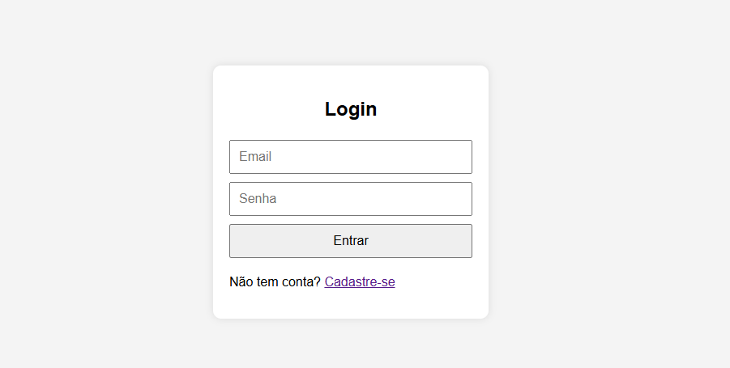
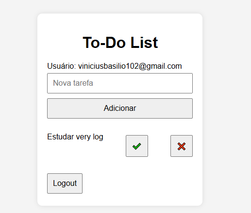

# ToDo-list
Projeto de Teste de Software

# ✅ To-Do List com Login e Cadastro

Este é um projeto simples de **lista de tarefas (To-Do List)** com sistema de **cadastro e login de usuários**, desenvolvido usando HTML, CSS e JavaScript puro. 

## ✨ Funcionalidades

- Cadastro de novos usuários
- Login com validação de credenciais
- Adição e remoção de tarefas
- Marcar tarefas como concluídas
- Armazenamento local (não perde ao recarregar a página)
- Interface leve e responsiva

## 📸 Capturas de Tela
 
